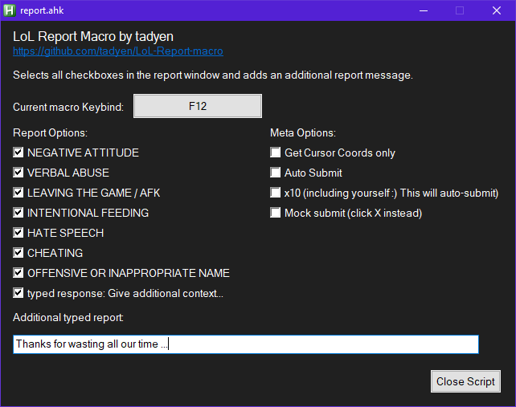

# LoL-Report-macro

AHK Macro to speed up the reporting process in LoL.

If you have an issue with this, you're probably part of the reason why this script was even made to begin with.

## Requirements

[AutoHotkey v1.1](https://www.autohotkey.com/)

## Usage

Download and run the ahk script.

Options are kinda self explanatory 😉

You need to be in the `Scoreboard` screen to use the macro.

Click the ❗ at the player ribbons to open the report screen.
Hitting the macro (default: F12) selects all the chosen checkboxes.

Using the Meta-Options, you can make it click the 'submit report' button automatically as well.

Use x10 mode to let the script autoclick every single ❗ and autosubmit them.
(I'm using mock-submits in the example below)

## Known issues

- Can't rebind to Mouse Buttons eg MB4/MB5
- Msg doesn't accept exclamation marks (and probably any punctuation for the matter)
- Very dogshit code. To call it any variety of pasta is a compliment

## Potential upgrades

I guess I could improve it with the following features in future:

- Pre-game lobby reporting option
- Checkboxes to select which players to report (to avoid hitting your duo)
